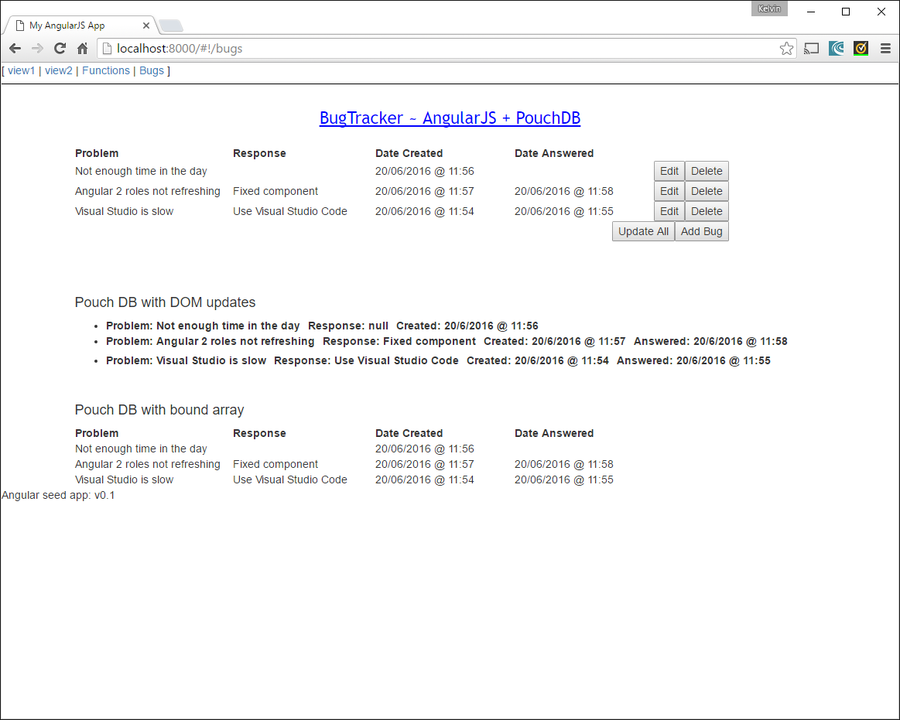
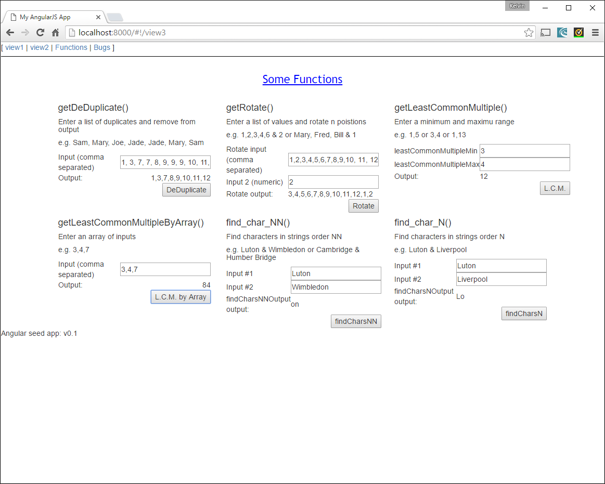

Using Angular seed to produce quick skelton application

This is a cut down version of SignalRRealTimeUpdates (https://github.com/admirkb/SignalRRealTimeUpdates) that contains version for pouchDB.

This is now standalone version of bug tracker. No signalR for real time updates as in above

Contains some functions together with karma tests

For Angular 2 latest and using Typescript head over to: https://github.com/admirkb/amc

<h4>Bugtracker with pouchDB</h4>

  

<h4>Some functions</h4>

  

<h4>Karma tests using Jasmine can be found in the file:</h4>

app/view3/view3_test.js

<h4>Instructions</h4>

Download zip

cd to extracted files folder

npm install

npm start for webpages (runs @ http://localhost:8000)

npm test for karma test suite. Should see 15 tests passing. n.b. Some of the original seed tests run.
